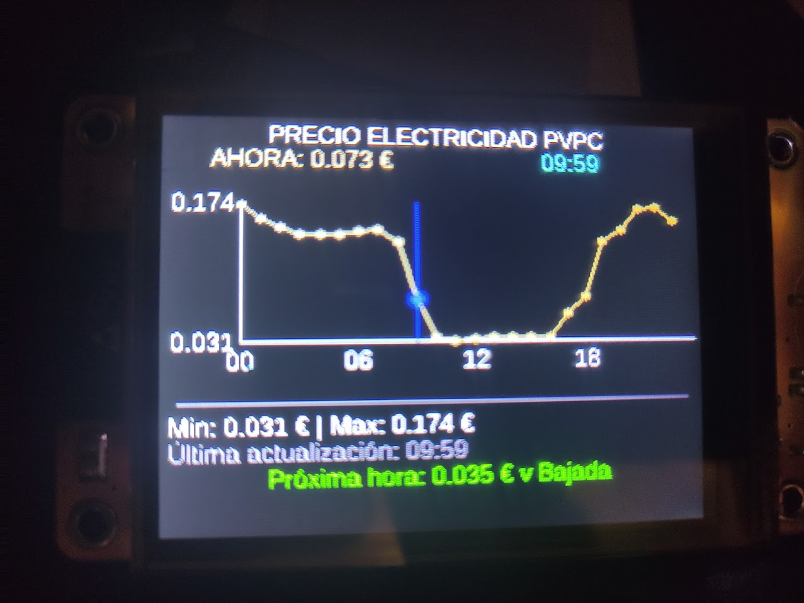
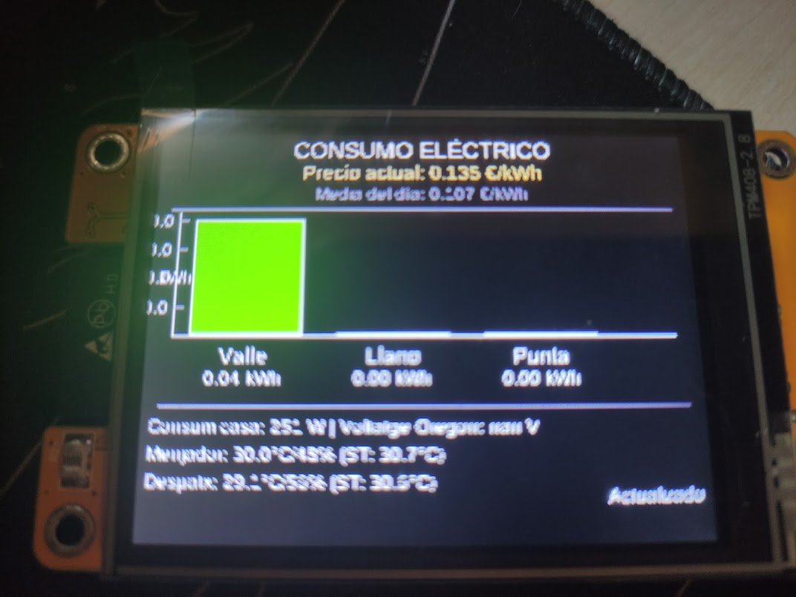

# ESP32 Sensor de Presencia - Pantalla TFT con Gráficas

Este proyecto implementa un sistema de visualización en tiempo real para monitorear precios de electricidad y consumos energéticos utilizando un ESP32 con pantalla TFT ILI9342.

## 📋 Descripción

El proyecto consiste en dos configuraciones principales de ESPHome, cada una en su propia carpeta:

1. **`preus_grafica/`** - Visualización de precios de electricidad PVPC
2. **`consums_franges/`** - Visualización de consumos por franjas horarias

### Organización del Proyecto

Cada configuración está completamente autocontenida en su carpeta, incluyendo:
- Archivo de configuración YAML
- Captura de pantalla de ejemplo
- Fuentes TTF necesarias
- README específico con documentación detallada

### Características

- **Pantalla TFT ILI9342** de 2.4" con resolución 320x240
- **Conexión WiFi** con IP estática configurada
- **Integración con Home Assistant** para obtener datos en tiempo real
- **Visualización de precios PVPC** con gráficas de barras
- **Monitoreo de consumos** por franjas horarias (valle, llano, punta)
- **Sensores de temperatura y humedad** integrados
- **Backlight controlable** via PWM

## 🛠️ Hardware Requerido

- **ESP32-2432S028** (ESP32 con pantalla TFT integrada)
- **Conexión WiFi** para comunicación con Home Assistant
- **Fuente de alimentación** 5V/2A recomendada

### Conexiones SPI

```
Display SPI:
- CLK: GPIO14
- MOSI: GPIO13  
- MISO: GPIO12
- CS: GPIO15
- DC: GPIO2

Touch SPI (opcional):
- CLK: GPIO25
- MOSI: GPIO32
- MISO: GPIO39

Backlight:
- PWM: GPIO21
```

## 📁 Estructura del Proyecto

```
esp32-test-grafica-kw/
├── preus_grafica/              # Configuración para gráfica de precios
│   ├── preus_grafica.yaml      # Archivo de configuración ESPHome
│   ├── preus_grafica.jpg       # Captura de pantalla
│   ├── fonts/                  # Fuentes TTF
│   └── README.md               # Documentación específica
├── consums_franges/            # Configuración para gráfica de consumos
│   ├── consums_franges.yaml    # Archivo de configuración ESPHome
│   ├── consums_franges.jpg     # Captura de pantalla
│   ├── fonts/                  # Fuentes TTF
│   └── README.md               # Documentación específica
├── fonts/                      # Fuentes compartidas (copia)
├── .gitignore                  # Archivos a ignorar en Git
└── README.md                   # Este archivo principal
```

## 📸 Capturas de Pantalla

### Gráfica de Precios PVPC


*Visualización en tiempo real de los precios de electricidad PVPC con gráfica de barras por horas*

### Gráfica de Consumos por Franjas


*Monitoreo de consumos eléctricos por franjas horarias (valle, llano, punta) con datos ambientales*

## ⚙️ Configuración

### 1. Instalación de ESPHome

```bash
# Instalar ESPHome
pip install esphome

# O usando Docker
docker run --rm -v "${PWD}":/config -it esphome/esphome
```

### 2. Configuración de WiFi

El proyecto utiliza un archivo `secrets.yaml` para almacenar las credenciales de forma segura. Edita este archivo con tus datos:

```yaml
# Credenciales WiFi
wifi_ssid: "TU_WIFI_SSID"
wifi_password: "TU_WIFI_PASSWORD"

# Configuración de red
static_ip: "192.168.68.45"  # Cambia a tu IP deseada
gateway: "192.168.68.1"
subnet: "255.255.255.0"

# Configuración de acceso point de respaldo
ap_ssid: "esp32_fallback"
ap_password: "fallback123"
```

**⚠️ Importante**: El archivo `secrets.yaml` ya está incluido en `.gitignore` para evitar que las credenciales se suban al repositorio.

### 3. Configuración de Home Assistant

Asegúrate de tener configurados en Home Assistant:

- **Sensor de precios PVPC** (`sensor.esios_pvpc`)
- **Sensores de consumo** por franjas horarias
- **Sensores de temperatura y humedad**

### 4. Compilación y Flasheo

```bash
# Compilar y flashear preus_grafica
esphome run preus_grafica/preus_grafica.yaml --device /dev/ttyUSB0

# Compilar y flashear consums_franges  
esphome run consums_franges/consums_franges.yaml --device /dev/ttyUSB0
```

## 🎨 Personalización

### Fuentes

El proyecto incluye varias fuentes en el directorio `fonts/`. Para cambiar la fuente:

1. Añade tu archivo TTF al directorio `fonts/`
2. Modifica la sección `font:` en el archivo YAML
3. Ajusta el tamaño y los caracteres incluidos según necesites

### Colores

Los colores están definidos en la sección `color:`. Puedes personalizar:

```yaml
color:
  - id: white
    hex: ffffff
  - id: ha_blue
    hex: 51c0f2
  # Añade más colores según necesites
```

### Layout de Pantalla

El layout se define en la sección `display:` dentro del `lambda:`. Puedes modificar:

- Posiciones de texto y gráficas
- Tamaños de barras y gráficas
- Colores y estilos

## 📊 Sensores Integrados

### Sensores de Precios
- Precio actual PVPC
- Precios por hora (00h-23h)
- Precio medio del día

### Sensores de Consumo
- Consumo en franja valle
- Consumo en franja llano  
- Consumo en franja punta

### Sensores Ambientales
- Temperatura y humedad del comedor
- Temperatura y humedad del despacho
- Sensación térmica
- Voltaje de batería (Oregon)

## 🔧 Mantenimiento

### Logs

Los logs se pueden ver en tiempo real:

```bash
esphome logs preus_grafica/preus_grafica.yaml
esphome logs consums_franges/consums_franges.yaml
```

### Actualizaciones OTA

Las actualizaciones se pueden hacer por WiFi:

```bash
esphome run preus_grafica/preus_grafica.yaml --device 192.168.68.45
esphome run consums_franges/consums_franges.yaml --device 192.168.68.45
```

### Backup

Es recomendable hacer backup de las configuraciones YAML antes de cambios importantes.

## 🐛 Solución de Problemas

### Pantalla no muestra nada
- Verifica las conexiones SPI
- Comprueba que el backlight esté encendido
- Revisa la configuración de rotación

### No se conecta a WiFi
- Verifica credenciales WiFi
- Comprueba que la IP estática no esté en conflicto
- Revisa la configuración de gateway y subnet

### Datos no se actualizan
- Verifica la conexión con Home Assistant
- Comprueba que los entity_ids sean correctos
- Revisa los logs de ESPHome

## 📝 Licencia

Este proyecto es de código abierto. Siéntete libre de modificarlo y distribuirlo.

## 🤝 Contribuciones

Las contribuciones son bienvenidas. Por favor:

1. Fork el proyecto
2. Crea una rama para tu feature
3. Commit tus cambios
4. Push a la rama
5. Abre un Pull Request

## 📞 Soporte

Para soporte o preguntas, puedes:

- Abrir un issue en el repositorio
- Contactar al desarrollador principal
- Consultar la documentación de ESPHome

---

**Desarrollado con ❤️ para el monitoreo energético doméstico** 