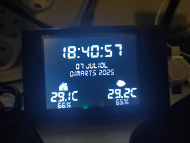

# Proyectos ESP32 con pantalla TFT

Este repositorio contiene varios proyectos de visualización para ESP32 con pantalla TFT, integrados con Home Assistant. Cada carpeta corresponde a un proyecto independiente, con su propia funcionalidad y ejemplo visual.

## Proyectos incluidos

### 1. `rellotge_temps/`
**Reloj digital, sensores y meteorología**  
Muestra la hora, fecha, día de la semana y año en catalán, junto con temperatura y humedad interior/exterior. Incluye iconos dinámicos según el estado meteorológico de Met.no y control de brillo del backlight.

---

### 2. `consums_franges/`
**Gráfica de consumos eléctricos por franjas horarias**  
Visualiza en tiempo real los consumos eléctricos por franjas (valle, llano, punta), junto con datos ambientales y voltaje de batería.

---

### 3. `preus_grafica/`
**Gráfica de precios PVPC**  
Muestra los precios de la electricidad PVPC por hora, con gráfica de barras, precio medio diario e indicadores visuales de franjas.

---

### 4. `menu_principal/`
**Menú principal táctil (NO ACABADO)**  
Sistema de navegación táctil para acceder a las diferentes pantallas de información (precios, consumos, sensores, etc.) desde un menú principal con iconos y botones.

<!-- Añade aquí la imagen de ejemplo cuando esté disponible -->

---

## Requisitos generales

- ESP32-2432S028R (Cheap Yellow Display)
- ESPHome 2025.x o superior
- Home Assistant para integración de sensores y meteorología

---

**Desarrollado con ❤️ para el monitoreo y visualización doméstica** 